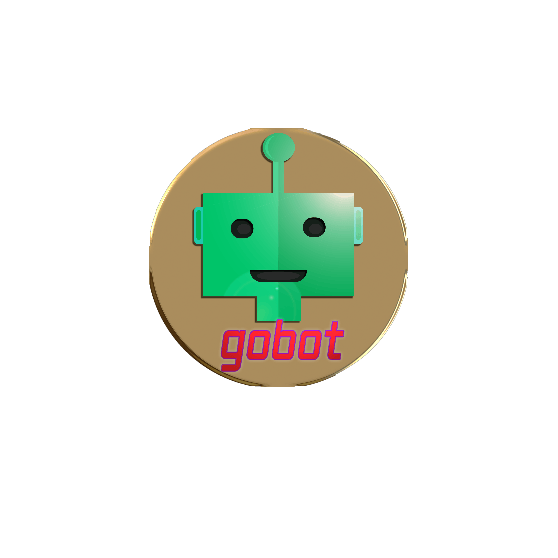

# gobot
## PhD work ported to Go

`gobot` is a simplified prototype of a cluster of intelligent agents roaming a virtual world (theoretically either in Second Life or OpenSimulator). Users can visually programme the paths/activities such agents are supposed to follow by __visually__ dragging simple markers around the virtual world, without the need of learning any computer language. The principle is similar, and based on, several computer games where the player also gives visual commands to an AI controlling the players' units (like in Command & Conquer, StarCraft, or The Sims).

Right now, the Go application just deals with visualising the support database and adds some tools to give manual commands to the in-world markers (known simply as 'cubes' in `gobot`); a prototype run of the engine is being ported from previous code originally in PHP. Go, because of its very simple and intuitive approach to multithreading, will be used to allow each agent to get their own thread running the AI engine.
 
One day, the whole thing will be fully described here!
For now, all you need to know is that this works only on [OpenSimulator](http://opensimulator.org) since Second Life does not allow intelligent agents to be created and run in the same way as OpenSimulator does.

## Server-Side Configuration

- Install `gobot` as any other Go application (`go get github.com/GwynethLlewelyn/gobot` should do the trick)
- Create a database in SQLite3 using `database/schema.sql`
- Create a new user in SQLite3 with an email address and a MD5-hashed password (something like `insert into Users (Email, Password) Values ('valid@email.address', '4405c5984441a1b86bec717dc063ca46');`), you'll need at least one user to login to the backoffice; use `echo "password"|md5sum` or an online MD5 generator to get a valid password hash; afterwards, you can add more users manually 
- Remember the installation path and change `config.toml` accordingly! (you should also set an URL to grab a map tile from your OpenSimulator environment)
- Note:
 - The directories `lib/` and `templates/` only have static content, so either you configure `config.toml` to  point to the right directories (if running `gobot` as a standalone Go application) or you get these directories directly served by your webserver/reverse proxy/whatever
- Point your browser to the URL of the `gobot` appplication, login with the email/password, and try things out on the menus

If you're placing `gobot` behind a nginx server, [this is the configuration you'll need](nginx-config.md). Note that Go is wonderful as it includes its own webserver, so running it behind a 'real' web server is not necessary, although a real web server should be able to provide things like caching and direct serving of static content (images, JS, CSS...) for the backoffice, to make it even faster.

## Dependencies

These will be installed, *but* you *should* make sure you have the latest versions of them! (use git pull on the directories)

- [agGrid](https://www.ag-grid.com/)
- [Bootstrap](http://getbootstrap.com/) and [Bootstrap Dialog](https://nakupanda.github.io/bootstrap3-dialog/)
- StartBootstrap's [SB Admin 2](https://startbootstrap.com/template-overviews/sb-admin-2/) template
- [Leaflet.js](http://leafletjs.com/) (called remotely, no need to worry about it)
- [Leaflet.vector-markers](https://github.com/hiasinho/Leaflet.vector-markers) (to get cute markers for Leaflet)
- [Prism.js](http://prismjs.com/) (called remotely, no need to worry about it)
- Gravatar Hovercard support (also called remotely except for one file)

## Configuration on the Virtual World

Here is one of the toughest parts of the configuration. 

Move over to the _LSL scripts_ menu option. These should pre-generate correctly configured LSL scripts for the many in-world scripts. Copy & paste them inside the LSL editor on the SL Viewer Application of your choice, and drop them inside the appropriate cubes.

You should at least place on OpenSimulator one box with a 'Bot Controller' LSL script (you can have multiple Bot Controllers if you wish, spread out over several sims or grids, and control them all from a single interface). The Bot Controller item will only launch new agents, it does not do anything else (all AI logic is actually done in Go, and the actual commands given to the agents are directly made from `gobot` to each individual agent). Note that while the Bot Controller will _mostly_ be controlled via the Web interface (or from the `gobot` application itself), you can also _manually_ activate it in-world using chat commands to channel 10, e.g. use `/10 help` to get a list of commands.

Touching the Bot Controller on any lateral face (_not_ the top one!) will reset it, and it will attempt to contact the `gobot` application to do a new registration. The inventory contents will also be uploaded (this is mostly because in the future animations and the like will be controlled from the Bot Controller).

Agents will try to use the Energy, Happiness, and Money cubes; you can have as many of those as you wish, and they are registered with the 'Register Position' script. It's not obvious, but the Description field will tell which class of agent should use that particular cube. I think that the default is 'peasant' but you will have to figure it out on your own (if you leave the description blank, the cube will _not_ work!). The three types of cubes will have hovertext to show its current values, and you can set them up as you wish (there is just one script for all three types anyway); currently, you can touch & drag on the _top_ face to set the three values, although for _precise_ values you might just write the numbers on the description. As with the Bot Controller, you can touch on the _lateral_ faces to reset the cube (it will attempt to register again, send the current settings for Energy/Happiness/Money, get an URL for communication, and so forth). Cubes will regularly update their status with the `gobot` application, just to make sure that the engine has their current positioning data correctly.

The tough bit will be configuring Agents, or, as OpenSimulator calls them, NPCs.

Because everything is controlled via `gobot` (as opposed to a specific, C#/libopenmetaverse-based application), NPCs need to communicate (and receive commands) from the exterior world. The script `Register Agent` will basically act as a 'remote controller' for the NPC — it will register with `gobot` and allow the external application to send commands to it. The other two scripts, with the (legacy) names `Sensorama.lsl` and `llCastRay detector script 3.1.lsl` are the NPC's eyes & ears — they will attempt to gather as much data from the environment around the NPC as possible with the limited functionality offered by LSL.

`Sensorama.lsl` is the oldest-fashioned way of collecting in-world objects: it registers a LSL sensor around the NPC, and every item it finds in the sensor's range will be placed into an array. Unfortunately, LSL just sends you back the first 16 items (or agents) it finds. The good news is that at least you get their position, rough size (a bounding box around the item), and even its velocity, if it's moving. The bad news, of course, is that you can miss a lot — and that's why this is a _repeating_ sensor, sending _everything_ that it 'sees' back to the engine on `gobot`. The problem is getting rid of stale objects, i.e. those who have really disappeared from the region (and not merely moved away!), so there is a garbage collector built-in on `gobot` which will delete old objects after a while. There is no problem if it accidentally deletes an 'active' object from the database, which, for some reason, has stopped contacting the application (maybe because the region was slow, or a particular script had low priority when running, or a glitch in the region code, whatever...); later, as that object gets scanned again, it gets back into the database.

Note that scanning objects is a _collaborative_ effort: _all_ agents write to the _same_ database about what items they have 'found'. So, the more agents are roaming the region, the more likely the data will be more and more accurate.

`llCastRay detector script 3.1.lsl` also tries to detect the environment around the NPC. The concept, however, is slightly different: a 'virtual ray' is emitted from the NPC (the direction can be specified in LSL), and everything that this beam crosses will be retrieved into a list of objects — which, in turn, can be polled for additional information (e.g. size, velocity, and so forth). The `llCastRay()` function is directly tied to lower-level tools in the physics engine which provide this functionality directly, as opposed to the sensors, which require geofencing code to extract relevant data from the database (which is more resource-consuming, takes longer, and so forth); thus, `llCastRay()` would _theoretically_ be much more efficient, but there is a catch: it can be 'abused' to the point that the physics engine may be overloaded with way too many calls. Therefore, both OpenSimulator and Second Life limit the amount of rays that can be cast; and once that amount is reached, NPCs would become 'blind', unable to perceive anything in their immediate surroundings. That's why both kind of 'detection' work simultaneously (and cooperatively!) to fill up the database with as much data as it can be extracted from the environment; this 'common knowledge database' is actually what the engine uses to have an idea of how the environment looks like. Note that only the Energy/Happiness/Money are _active_ elements in the environment, telling the engine their _precise_ location; everything else must somehow be acquired with 'artificial vision' through those two scripts.

Note that when the llCastRay detector is operational, there will be a 'laser beam' emitted from the NPC to the item it is currently analysing and considers to be 'in front of them'. Sometimes the NPC will turn the beam off: this means that there are no objects _directly_ in front of it. Unlike sensors, which are cones (or even spheres!), the llCastRay is a tight beam (theoretically of zero thickness) and may therefore produce unexpected results as it goes through certain objects (by narrowly missing their edges!). Nevertheless, _when_ it crosses an object, it is much more accurate in knowing that such an object is _really_ in the path of the agent.

In order for all the above to work, these three scripts (registration/commands, sensor, llCastRay) must be on an object attached to the NPC. So to prepare a 'template' NPC, you should do the following:

  - Start with your own avatar, stripping it from anything unnecessary.
  - Make sure that all scripts have been set to all permissions.
  - Create a transparent object attached to your chest or hip which covers the whole avatar. Cubic designs work better than spheres, but you are welcome to experiment a bit. My own personal choices is a cubic thingy which covers the avatar like a 'bounding box'. It does not need to be a 'perfect' shape — at least, not until a few bugs are fixed to allow NPCs a _third_ way of detecting objects, namely, _bumping into things_; this is supposed to be a 'feature' which works terribly both on SL and on OpenSimulator, so I've mostly abandoned hope of seeing it fixed (and yes, I tried to fix it myself, to no avail), but after seven years of waiting, I simply cannot rely on it any longer — but it works best if most of the avatar is really covered, from head to toe.
  - Once you place the 3 scripts inside, of course they will start registering with `gobot` and send sensor/llRayCast() data to the engine; don't worry, you can always delete that later through the Web backoffice (or keep that data, since it will be valid for the environment you're on!).
  - Now comes the tricky bit: your own avatar needs to be 'cloned' to act as a 'template' for the NPCs. This is accomplished by going near to the Bot Controller and typing `/10 clone name-of-notecard`, which, after a few seconds, will drop a notecard with that name _inside the Bot Controller_.
  - Once that's done, you can start creating as many bots as you wish (until the region crashes!) using the Web command to create a new NPC. The first parameter (string) is the new name of the 'bot, and the second parameter (also a string) is the  name of the notecard to be used to create the avatar.
  - If you did all the above steps correctly, you should now be able to create new NPCs which have a copy of the scripts inside a transparent object attached to them, and all will try to register with `gobot` and starting happily to send information about the environment to the engine.

More to come...

## Hidden Easter Eggs

Sending a SIGHUP will reload the configuration file (as expected)

SIGUSR1 will send a randomly generated female name to appear on the Engine page; SIGUSR2 will place a random country. Why? Well, this was the only way to get *something* to appear there while testing the code (and without creating a new backoffice just for testing purposes). Now if I only came up with pipes and more esoteric stuff... 😉

## License

This is currently copyrighted until I finish my PhD, then you can copy it at will. If you wish to use my code **now**, then please ask me before! Thank you!